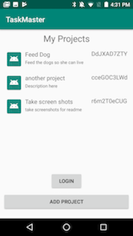
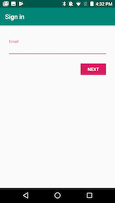
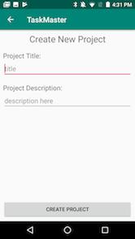
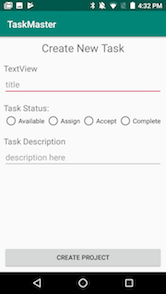

# Task Master
## Description
This Android application helps users manage projects. Each Project has a list of tasks that need to be completed before a project can be closed out.
### Features

:ok_woman: | Feature | Description
--- |---- | ----
:ok_woman: | **Create a Project** | Users should be able to create a `Project`, add a `Task` and save locally to the database.
:no_good: | **Project Progress** | A user should be able to “Assign” themselves a task, “Accept” that task, and later “Complete” that task.
 :ok_woman: | **Login** | Users should be able to log in. At a minimum, they should be able to log in with email and password.
 :no_good: | **Assigned Tasks** | Users should be able to view all of the tasks assigned to them on a screen.
 :no_good: | **Sort Task** | Users should be able to sort the tasks assigned to them based on the title of the task, the state the task is in, or the person who assigned the task to them. This sorting should be done in the cloud, to avoid using too many resources on the user’s phone.
 :no_good: | **Accessibility** | Any iconography in your app should be well-labeled with a contentDescription. Use the hint attribute on all editable elements in your app, or labelFor to allow a TextView to serve as a label. Use the focusable attribute to show that a particular ViewGroup consists of one piece of data.
 :no_good: | **Testing** | Test manually using TalkBack to ensure your app is navigable through that interface. Use the Accessibility Scanner to run automated testing. Use the “Share Results” dialog to send yourself the zip file, and include those screenshots/results in your README. Enable AccessibilityChecks on your existing Espresso tests.
 :ok_woman: | **Package** | Build an .apk file that can be directly installed on a device. Include that file in your repo, linked from your README.

 
 
 
 

## Resources
- [Using Firebase](https://firebase.google.com/docs/android/setup)
- [Auth with Firebase](https://firebase.google.com/docs/auth/?utm_source=studio)

## Daily Change Log
- Day 1:
    - Create the Room database
- Day 2:
    - Scrap Day 1
    - Build UI for application
- Day 3:
    - firebase Login/SignUp
    - pull data from Database
- Day 4:
    - Update Project Recycler View when db is updated
    - Link to Project View and Task Create
- Day 5:
    - Tie up some loose ends
    - Generate APK